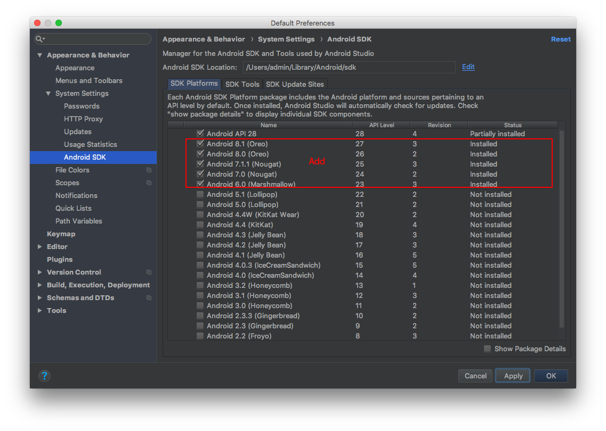
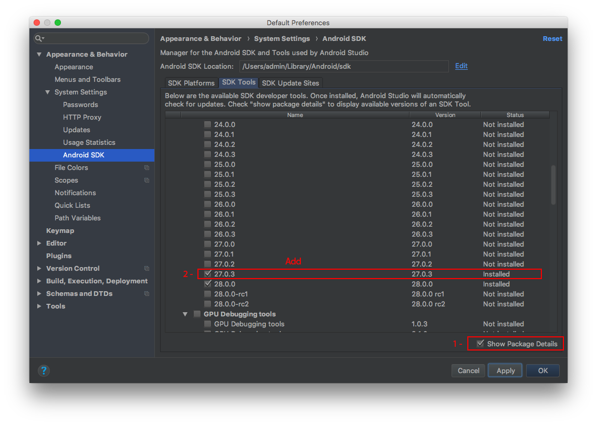

# <a name='top'>Installing NativeScript

We have in the beginning:

* June 2018
* Hight Sierra 10.13.5
* Xcode need to update to 9.4.1 (12.89 GB), download here: [developer.apple.com](https://developer.apple.com/download/more/)

<a name="homebrew"><h2>1. Installing Homebrew</h2></a>

`ruby -e "$(curl -fsSL https://raw.githubusercontent.com/Homebrew/install/master/install)"`

> **If problems**
<br>Error: Could not link: /usr/local/**path**
<br> Solution: 
<br>`rm -rf /usr/local/**path**`
<br>`brew update`

Checking: `brew -v`. Result: `Homebrew 1.6.9`
  
<a name="ruby"><h2>2. Installing last Ruby</h2></a>

Checking: `ruby -v`. Result: `ruby 2.3.3p222` -- in 10.13.5 High Sierra

2.5.1 (Recommended) -> [gorails.com/setup](https://gorails.com/setup/osx/10.13-high-sierra)

* `brew install rbenv ruby-build`

> **If problems**
<br>Error: Another active Homebrew process is already in progress. 
<br>Solution: `sudo chown -R "$USER":admin /usr/local/var/homebrew`

* Add **rbenv** to **bash** so that it loads every time you open a terminal: 

`echo 'if which rbenv > /dev/null; then eval "$(rbenv init -)"; fi' >> ~/.bash_profile`

`source ~/.bash_profile`

Install Ruby:

`rbenv install 2.5.1`

`rbenv global 2.5.1`
  
Checking: `ruby -v`. Result: `ruby 2.5.1p57 (2018-03-29 revision 63029)`
  
<a name="node"><h2>3. Installing NodeJS</h2></a>
  
Without indication *sudo*: `brew install node`

> **If problems**
<br>Error: /usr/local/Cellar is not writable. 
<br> Solution: `sudo chown -R $(whoami) /usr/local/Cellar`

>Error: Another active Homebrew process is already in progress. Please wait for it to finish or terminate it to continue. 
<br> Solution: `rm -rf /usr/local/var/homebrew/locks`

Checking: `node -v`. Result: `v10.5.0` -- 8.11.3 LTS | 10.5.0 Current, source: [nodejs.org](https://nodejs.org/en/)
Checking: `npm -v`. Result: `6.1.0`

> **Attention**:
<br>Do *not install* NodeJS from the package from the official site! Use **Brew** to avoid the risk of getting confused in the dependencies and something will not "start".
  
<a name="command-line"><h2>4. Installing Command Line Tools for Xcode</h2></a>

Download [Command Line Tools](https://developer.apple.com/download/more/) (macOS 10.13) for Xcode 9.4.1 (**192.5 GB**) and install.

<a name="xcodeproj"><h2>5. Installing Xcodeproj</h2></a>

`sudo gem install xcodeproj`

<a name="cocoapods"><h2>6. Installing CocoaPods</h2></a>

`sudo gem install cocoapods`

<a name="jdk"><h2>7. Installing Java Platform (JDK)</h2></a>

[Download](http://www.oracle.com/technetwork/java/javase/downloads/) the **.dmg* package from the Oracle site. And install.

Result: **jdk-10.0.1_osx-x64_bin.dmg**

<a name="android-studio"><h2>8. Installing Android Studio</h2></a>

[Download](http://www.oracle.com/technetwork/java/javase/downloads/) the *Android Studio* from the Android site. And install.

Result: **Android Studio 3.1.3 for Mac (849 MB)**

<a name="android-studio"><h2>9. Configuring the Shell Android Studio</h2></a>

Go into the settings of the Android Studio shell and install additional **SDK Platforms** Android versions 23-27 from the section and **SDK Build-tools** version 27.0.3:

```Android Studio -> Preferences... -> Appearance & Behavior -> System Settings -> Android SDK```

as shown in the figures below.





Then enter:

`echo "export JAVA_HOME=$(/usr/libexec/java_home)" >> ~/.profile`

`echo "export ANDROID_HOME=$HOME/Library/Android/sdk" >> ~/.profile`

Thus, the *.profile* file will be created or added if it already exists.

Apply variables without rebooting **bash**:

`export JAVA_HOME=$(/usr/libexec/java_home)`

`export ANDROID_HOME=$HOME/Library/Android/sdk`

Check the variables: 

`echo $JAVA_HOME`. Result: `/Library/Java/JavaVirtualMachines/jdk-10.0.1.jdk/Contents/Home`

`echo $ANDROID_HOME`. Result: `/Users/your-name/Library/Android/sdk`

Be sure to execute the command:

`sudo xcode-select -r`

<a name="android-studio"><h2>10. Install the NativeScript CLI</h2></a>

Without indication *sudo*: `npm install nativescript -g`

**Restart** the command prompt.

Verify the setup: `tns doctor`

Should be a positive result: `No issues were detected`

***

Additional material:

* [NativeScript Advanced Setup: macOS](http://docs.nativescript.org/start/ns-setup-os-x)

* [Setup your Mac to develop NativeScript Apps](https://hdorgeval.gitbooks.io/setup-your-mac-to-develop-nativescript-apps/content/)

* [Quick Setup](http://docs.nativescript.org/start/quick-setup)

***

<a name="remove"><h2>P.S. Remove NativeScript</h2></a>

`sudo npm uninstall nativescript -g`

**[⬆](#top)**
